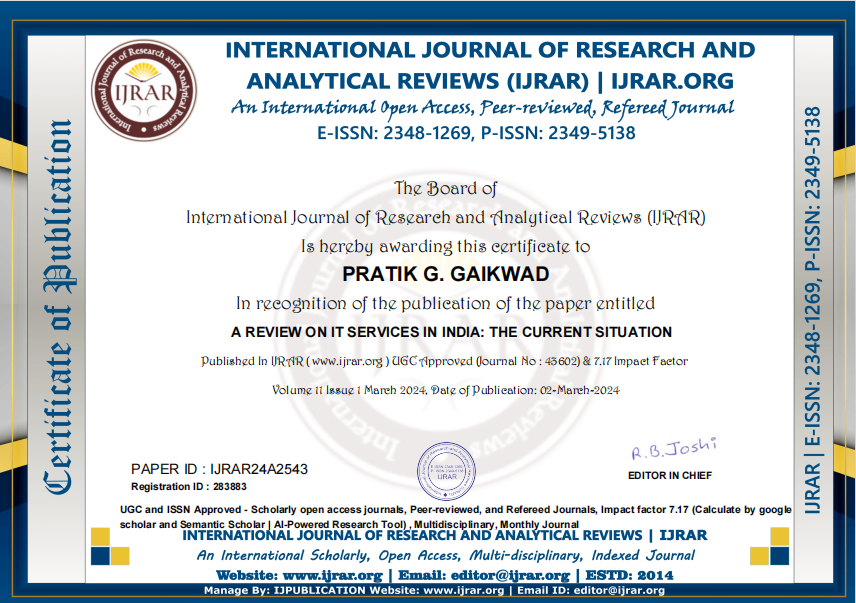

# Publication
The paper highlights India’s IT services sector evolving from outsourcing to a global innovation hub, driven by technologies like AI, IoT, and cloud computing, a skilled workforce, and government initiatives such as Digital India and Skill India. Despite challenges like competition and geopolitical uncertainties.

